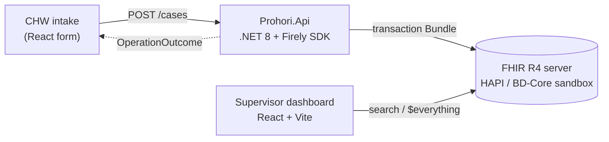

# Prohori

**FHIR-native field case registry for vector-borne disease.**
.NET 8 + Firely SDK (API & transaction-Bundle builder) · React + Vite (surveillance dashboard) · HL7 FHIR R4 / [BD-Core-FHIR-IG](https://fhir.dghs.gov.bd/core/)


-red)


> *Prohori* (প্রহরী) — Bengali for **sentinel / guardian**.

---

## What it is

A community health worker registers a patient, records a field visit, enters a
rapid diagnostic test (RDT) result, and records a diagnosis — submitted as one
atomic **FHIR transaction Bundle**. A supervisor opens a **web dashboard** that
lists cases, filters by disease / date / location, and drills into a single
patient's clinical timeline.

The data model starts as plain HL7 FHIR R4 and is progressively tightened to
Bangladesh's national **[BD-Core-FHIR-IG](https://fhir.dghs.gov.bd/core/)**, then
submitted to the live government sandbox.

Diseases in scope: **dengue** (SNOMED `38362002` / ICD-10 `A90`), **malaria**
(SNOMED `84058000`).

## Architecture



| Component | Stack | Hosting (live) |
| :--- | :--- | :--- |
| `web/` — dashboard + intake | React 18, Vite, TypeScript | Vercel (free) |
| `src/Prohori.Api` — bundle builder + submit API | .NET 8, `Hl7.Fhir.R4` | Render (free web service) |
| FHIR data store | HAPI FHIR R4 | BD-Core sandbox (`sandbox.fhir.dghs.gov.bd/fhir`) |
| `ig/` — conformance profiles | FHIR Shorthand + SUSHI | published with the repo |

## Build phases

| Phase | Scope | Status |
| :--- | :--- | :--- |
| **A** | FHIR REST API by hand (Bruno + curl); repo bootstrap | ✅ complete (`phase-a`) |
| **B** | Search — every param type, `_include`/`_revinclude`, `_has`, paging | ☐ |
| **C** | .NET 8 + Firely write client — transaction Bundle, conditional create | ☐ |
| **D** | React dashboard — case list, filters, patient timeline | ☐ |
| **E** | Self-hosted HAPI (Docker) + a `ProhoriPatient` profile, validation on | ☐ |
| **F** | BD-Core-FHIR-IG conformance + live submission to the DGHS sandbox | ☐ |
| **G** | Ship it live — Vercel + Render, seed data, polish | ☐ |

Full plan: `~/Documents/AIWORK/plan/Prohori — FHIR Field Case Registry (.NET + Firely) — Plan.md`.

## Repository layout

```
bruno/         Bruno API collection (Phase A–B) — open in Bruno, or:
scripts/       phase-a.sh — the same walkthrough in curl
fixtures/      sample FHIR resources
docs/          phase notes, search-query catalogue, architecture, screenshots
src/           Prohori.Api (.NET 8) — from Phase C
tests/         xUnit — from Phase C
web/           React + Vite dashboard — from Phase D
ig/            FHIR Shorthand sources + generated IG — from Phase E
deploy/        Dockerfile, render.yaml, docker-compose (local HAPI)
```

## Try Phase A

No toolchain needed beyond `curl` + `jq`:

```bash
bash scripts/phase-a.sh                       # against hapi.fhir.org/baseR4
bash scripts/phase-a.sh http://localhost:8080/fhir   # against your own server
```

Walks: `GET /metadata` → create → read → update → `_history` → delete →
`410 Gone` → an intentional `OperationOutcome`. Findings in
[`docs/phase-a-notes.md`](docs/phase-a-notes.md).

To click through it interactively: install [Bruno](https://www.usebruno.com)
(`brew install --cask bruno`) and open the `bruno/` folder.

## Development

| Phase | Prereqs |
| :--- | :--- |
| A–B | `curl`, `jq`, optionally Bruno |
| C | .NET 8 SDK |
| D | Node 22+ |
| E | Docker |
| E–F | Java 17+ (FHIR validator / IG Publisher), `fsh-sushi` |

## Standards & references

- [HL7 FHIR R4](https://hl7.org/fhir/R4/) · [RESTful API](https://hl7.org/fhir/R4/http.html) · [Search](https://hl7.org/fhir/R4/search.html)
- [Firely .NET SDK](https://docs.fire.ly/projects/Firely-NET-SDK/)
- [BD-Core-FHIR-IG](https://fhir.dghs.gov.bd/core/) · [DGHS sandbox](https://sandbox.fhir.dghs.gov.bd/fhir)
- [FHIR Shorthand / SUSHI](https://fshschool.org)

## License

[Apache-2.0](LICENSE) © 2026 Khalilur Rahman Ridoy Khan

> Synthetic data only. Not a medical device. Not for use with real patient data.
