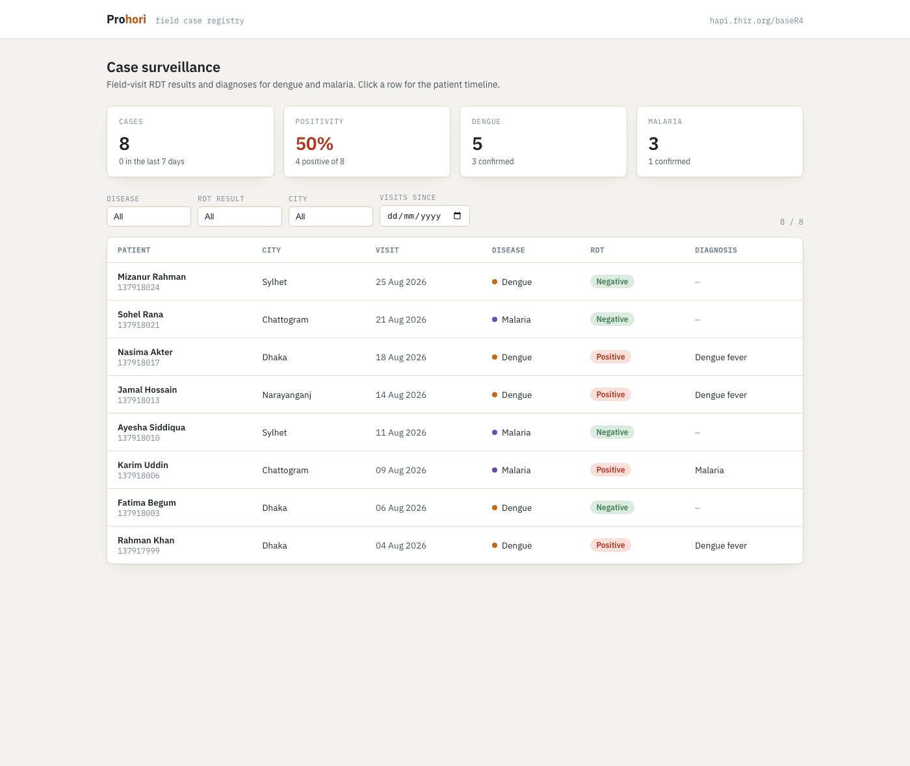
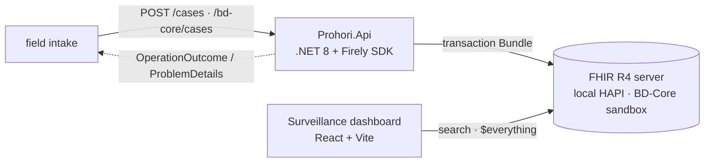
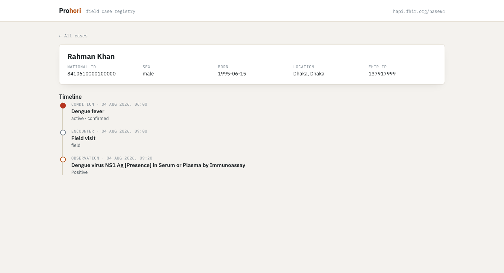

# Prohori

**FHIR-native field case registry for vector-borne disease.**
.NET 8 + Firely SDK (API & transaction-Bundle builder) · React + Vite (surveillance dashboard) · HL7 FHIR R4 / [BD-Core-FHIR-IG](https://fhir.dghs.gov.bd/core/)

[](https://github.com/khalilurrrahmanridoykhan/prohori-fhir-case-registry/actions/workflows/ci.yml)
-red)


> *Prohori* (প্রহরী) — Bengali for **sentinel / guardian**.

**Live dashboard → https://prohori-fhir-case-registry.vercel.app** (reads
Bangladesh's national FHIR sandbox directly). A case Bundle built by this project
is **accepted by that sandbox** ([`docs/bd-core-submission.md`](docs/bd-core-submission.md)).
The .NET API deploys to Render from [`deploy/render.yaml`](deploy/render.yaml) —
see [Deploy](#deploy-phase-g).

---



## What it is

A community health worker registers a patient, records a field visit, enters a
rapid diagnostic test (RDT) result, and records a diagnosis — submitted as one
atomic **FHIR transaction Bundle**. A supervisor opens a **web dashboard** that
lists cases, filters by disease / date / location, and drills into a single
patient's clinical timeline.

The data model starts as plain HL7 FHIR R4 and is progressively tightened to
Bangladesh's national **[BD-Core-FHIR-IG](https://fhir.dghs.gov.bd/core/)**, then
submitted to the live government sandbox.

Diseases in scope: **dengue** (SNOMED `38362002` / ICD-10 `A90`), **malaria**
(SNOMED `84058000`).

## Architecture



| Component | Stack | Hosting (free) |
| :--- | :--- | :--- |
| `web/` — surveillance dashboard | React 19, Vite, TanStack Query | Vercel |
| `src/Prohori.Api` — Bundle builder + submit API | .NET 8, Firely `Hl7.Fhir.R4` | Render (Docker web service) |
| FHIR data store | HAPI FHIR R4 | `sandbox.fhir.dghs.gov.bd/fhir` (DGHS) |
| `ig/` — `ProhoriPatient` profile | FHIR Shorthand + SUSHI | in-repo, validated in CI |
| `deploy/` — local HAPI | `hapiproject/hapi` + Docker Compose | your machine (Phase E) |

## Build phases

| Phase | Scope | Status |
| :--- | :--- | :--- |
| **A** | FHIR REST API by hand (Bruno + curl); repo bootstrap | ✅ complete (`phase-a`) |
| **B** | Search — every param type, `_include`/`_revinclude`, `_has`, paging | ✅ complete (`phase-b`) |
| **C** | .NET 8 + Firely write client — transaction Bundle, conditional create | ✅ complete (`phase-c`) |
| **D** | React dashboard — case list, filters, patient timeline | ✅ complete (`phase-d`) |
| **E** | Self-hosted HAPI (Docker) + a `ProhoriPatient` profile, validation on | ✅ complete (`phase-e`) |
| **F** | BD-Core-FHIR-IG conformance + live submission to the DGHS sandbox | ✅ complete (`phase-f`) |
| **G** | Ship it live — Vercel + Render, seed data, polish | ✅ config ready (`phase-g`) — see [Deploy](#deploy-phase-g) |

## Repository layout

```
bruno/                 Bruno API collection — root = Phase A CRUD, search/ = Phase B
scripts/               phase-a.sh, seed-cohort.py, phase-b.sh — curl / Python equivalents
fixtures/              sample FHIR resources
docs/                  phase notes, search-query catalogue, architecture, screenshots
src/Prohori.Api/       .NET 8 minimal API — POST /cases builds + submits a transaction Bundle
  Fhir/                CaseBundleBuilder, FhirCaseService, OperationOutcomeMapper
  Models/              CaseSubmission DTO
  Fhir/BdCore*             BD-Core-FHIR-IG bundle builder (Phase F) — POST /bd-core/cases
tests/Prohori.Api.Tests/  xUnit — 30 unit + 2 integration (Category=Integration)
.github/workflows/     ci.yml — .NET build+tests, dashboard build, IG validate, integration
web/                   React 19 + Vite + TS dashboard (Phase D)
ig/                    FHIR Shorthand profile (Phase E); SUSHI-generated output is gitignored
deploy/                docker-compose (HAPI + Postgres) — Phase E; render.yaml — Phase G
```

## Try Phases A & B

No toolchain needed beyond `curl`, `jq`, `python3`:

```bash
# Phase A — the CRUD / history / OperationOutcome walkthrough
bash scripts/phase-a.sh                       # against hapi.fhir.org/baseR4

# Phase B — seed a searchable cohort, then run the search catalogue
python3 scripts/seed-cohort.py
bash scripts/phase-b.sh
```

Phase A walks `GET /metadata` → create → read → update → `_history` → delete →
`410 Gone` → an intentional `OperationOutcome`
([`docs/phase-a-notes.md`](docs/phase-a-notes.md)).
Phase B runs 27 documented queries — string / token / date / composite params,
modifiers, `_include` / `_revinclude`, chaining, `_has`, `_sort` / `_count` /
paging, and `$everything` ([`docs/search-queries.md`](docs/search-queries.md)).

To click through it interactively: install [Bruno](https://www.usebruno.com)
(`brew install --cask bruno`) and open the `bruno/` folder.

## Run the API (Phase C)

Needs the **.NET 8 SDK**.

```bash
dotnet run --project src/Prohori.Api        # -> http://localhost:5279, Swagger at /swagger
dotnet test                                  # 19 unit + 2 integration tests
dotnet test --filter "Category!=Integration" # unit only (the CI gate)
```

Submit a case:

```bash
curl -X POST localhost:5279/cases -H 'Content-Type: application/json' -d '{
  "patient": { "nationalId": "19942691012345678", "familyName": "Khan",
    "givenNames": ["Rahman"], "gender": "male", "birthDate": "1995-06-15",
    "city": "Dhaka", "district": "Dhaka" },
  "disease": "dengue", "rdtResult": "positive", "visitDate": "2026-08-14T09:20:00+06:00"
}'
# 201 { "created": ["Patient/…", "Encounter/…", "Observation/…", "Condition/…"] }
```

Point it at another server: `Fhir__BaseUrl=http://localhost:8080/fhir dotnet run --project src/Prohori.Api`.

## Run the dashboard (Phase D)

Needs **Node 22+**. Reads the FHIR server directly (no API dependency for the read views).

```bash
python3 scripts/seed-cohort.py          # put a demo cohort on the server
cd web
cp .env.example .env
npm install
npm run dev                              # http://localhost:5173
```

Case list, summary tiles, filters (disease / result / city / date), and a
per-patient timeline via `$everything`. See [`web/README.md`](web/README.md).

| | |
| :--- | :--- |
|  |  |

## Run your own server + profile (Phase E)

```bash
# macOS daemon (no Docker Desktop needed): brew install colima docker docker-compose && colima start --cpu 4 --memory 6
docker compose -f deploy/docker-compose.yml up -d       # HAPI FHIR (embedded H2)
cd ig && sushi . --snapshot && cd ..                    # build the ProhoriPatient profile
bash scripts/load-profile.sh                            # push it into the local HAPI
bash scripts/validate-ig.sh                             # check it against the expectation fixtures
```

The local server then validates every write against the resource's `meta.profile`
— a Patient without a Bangladesh National ID comes back `422`.
See [`docs/phase-e-notes.md`](docs/phase-e-notes.md) and [`ig/README.md`](ig/README.md).

## Submit to Bangladesh's national FHIR sandbox (Phase F)

```bash
bash scripts/bd-core.sh            # build a BD-Core Bundle + validate against bd.fhir.core
bash scripts/bd-core.sh --submit   # ... then POST it to sandbox.fhir.dghs.gov.bd
```

`POST /bd-core/cases` on the API builds a 5-resource transaction Bundle
(Organization / Practitioner / Patient / Encounter / Observation) conformant to
**BD-Core-FHIR-IG v0.4.6** — UHID + NID identifiers, Bangla/English name
extensions, division/upazila geocodes, ICD-11 diagnosis. Verified: **0 validator
errors** and **accepted by the live DGHS sandbox**.
See [`docs/bd-core-submission.md`](docs/bd-core-submission.md).

## Deploy (Phase G)

Everything is configured for a **$0** deploy. One-time setup:

**Dashboard → Vercel** — **done:** https://prohori-fhir-case-registry.vercel.app
(import the repo, Root Directory `web`, Framework Vite; `web/.env.production`
points `VITE_FHIR_BASE` at the DGHS sandbox; pushes to `main` auto-deploy).

**API → Render**
1. [dashboard.render.com](https://dashboard.render.com) → **New → Blueprint** →
   connect the repo. It reads [`deploy/render.yaml`](deploy/render.yaml)
   (free Docker web service, `/health` check, `Fhir__BaseUrl` → DGHS sandbox).
2. After the first deploy, add repo variable `RENDER_API_URL` (Settings → Secrets
   and variables → Actions → Variables) so
   [`keepalive.yml`](.github/workflows/keepalive.yml) pings it every 13 min.

**Seed the demo data** so the live dashboard isn't empty:

```bash
python3 scripts/seed-cohort.py https://sandbox.fhir.dghs.gov.bd/fhir
```

Local Docker equivalent: `docker build -f deploy/Dockerfile -t prohori-api .`

## Development

| Phase | Prereqs |
| :--- | :--- |
| A–B | `curl`, `jq`, `python3`, optionally Bruno |
| C | .NET 8 SDK |
| D | Node 22+ |
| E | Docker or Colima (local HAPI), Node + `fsh-sushi` (profile), Java 11+ (validator) |
| F | .NET 8 SDK, Java 11+ (`validator_cli.jar`) — `scripts/bd-core.sh` fetches the BD-Core package |
| G | a Vercel account + a Render account (both free) |

## Phase-by-phase

Each phase is one PR + a `phase-*` tag; `main` is always demoable. Notes and
decisions live in [`DECISIONS.md`](DECISIONS.md) and `docs/phase-*-notes.md`.

## Standards & references

- [HL7 FHIR R4](https://hl7.org/fhir/R4/) · [RESTful API](https://hl7.org/fhir/R4/http.html) · [Search](https://hl7.org/fhir/R4/search.html)
- [Firely .NET SDK](https://docs.fire.ly/projects/Firely-NET-SDK/)
- [BD-Core-FHIR-IG](https://fhir.dghs.gov.bd/core/) · [DGHS sandbox](https://sandbox.fhir.dghs.gov.bd/fhir)
- [FHIR Shorthand / SUSHI](https://fshschool.org)

## License

[Apache-2.0](LICENSE) © 2026 Khalilur Rahman Ridoy Khan

> Synthetic data only. Not a medical device. Not for use with real patient data.
