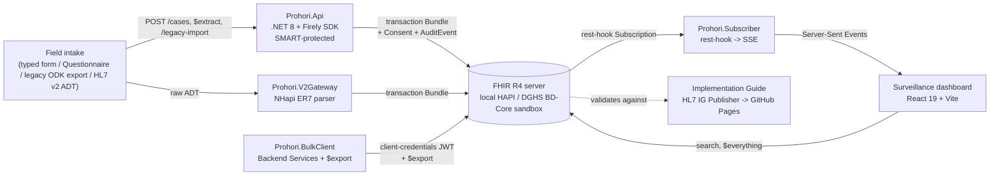

# Prohori — architecture case study

*How a FHIR-native disease surveillance registry was built, phase by phase, and what it's actually good evidence of.*

**Live dashboard:** https://prohori-fhir-case-registry.vercel.app
**Live Implementation Guide:** https://khalilurrrahmanridoykhan.github.io/prohori-fhir-case-registry/
**Source:** https://github.com/khalilurrrahmanridoykhan/prohori-fhir-case-registry

## The problem

A community health worker records a field visit for a vector-borne disease
(dengue or malaria): a patient, a rapid diagnostic test result, sometimes a
diagnosis. That has to become a FHIR-conformant record a national health
system can actually accept — not a bespoke JSON shape that happens to look
like FHIR. Prohori is that write path, built up one real capability at a
time against real servers: a public sandbox, a self-hosted HAPI instance,
and Bangladesh's actual national FHIR implementation guide's own sandbox.

## Architecture

Every write — regardless of entry point — ends at the same function,
`FhirCaseService.SubmitAsync`: the typed API, the SDC form's `$extract`, a
legacy ODK import via `$translate`, even `Prohori.V2Gateway`'s independent
HL7 v2 mapper builds the same Patient/Encounter/Observation(/Condition)
shape. That single choke point is also where cross-cutting concerns —
default-permit Consent, an AuditEvent naming who wrote what — get added
once, atomically, in the same transaction, rather than reimplemented at
every entry point.

## Decisions that mattered

**Server-side profile enforcement, not client-side validation.** The
`ProhoriPatient` and `ProhoriObservation` profiles are enforced by a real
HAPI JPA server's request-time validation, not a schema check in the API
layer. A malformed National ID gets rejected by the server that actually
owns conformance, the same way a production deployment would reject it.

**Conform to the national IG, submit to the real sandbox, and report what's
actually wrong with it.** BD-Core-FHIR-IG v0.4.6 ships
`bd-condition-icd11-diagnosis-valueset` with an empty `compose` — a required
binding with nothing in it, making the resource that binds to it
unsubmittable as specified. Rather than silently working around this,
Prohori documents the defect, works around it defensibly (the diagnosis
moves to `Encounter.reasonCode`, which carries no required binding), and —
in Phase K — authors the ValueSet BD-Core should have shipped, as a
standalone artifact with a draft upstream issue.

**Say what's real and what's declared.** Not every FHIR mechanism this
project touches has a live engine behind it, and the project says so
explicitly rather than faking execution: HL7 v2's FHIR Mapping Language
(`hl7v2-to-fhir.map`) is authored and reviewable but not run through a live
`$transform` — checked first, not assumed, since neither the local FHIR
server nor the plan's named alternative (matchbox) exposed the operation.
The same pattern holds for CQL→ELM compilation. A `MeasureReport` still gets
computed — server-side, from the same declared CQL population logic — just
without claiming a live CQL engine did it.

**Verify against a live terminology server, not just a static validator.**
An offline FHIR validator can't meaningfully check whether a SNOMED or
LOINC code is real; it can only check shape and cardinality. Phase N's
Implementation Guide build — which validates its own ValueSets against live
`tx.fhir.org` as a normal part of building — caught two codes that were
never real at all: a SNOMED code and a LOINC code used for malaria since an
early phase, both silently accepted by every earlier phase's checks because
none of them checked a coded element's *value*. Confirmed independently via
`$lookup`, fixed everywhere the wrong codes appeared — the API, the
dashboard, the bulk client, the seed script, the tests. Dengue's codes were
already correct, independently verified against the live DGHS sandbox
earlier in the build; nothing had ever forced the same check for malaria's.

**A real rest-hook Subscription, not a poll loop.** The dashboard's live
updates come from HAPI actually delivering a webhook — registered as a real
R4 `Subscription`, received by a purpose-built service, rebroadcast over
Server-Sent Events. Getting this working surfaced two genuine HAPI
behaviors worth knowing before you hit them in production: subscriptions
are off by default behind a specific (and non-obviously-shaped) config key,
and once a payload type is configured, HAPI's delivery is a `PUT` to
`{endpoint}/{ResourceType}/{id}` — treating the subscriber's endpoint as a
FHIR base URL, not a fixed webhook address.

## The SMART / Bulk / Terminology layers

- **SMART App Launch 2.0** (standalone and EHR launch) against both the
  public SMART Health IT sandbox and a self-hosted Keycloak instance, with
  PKCE, scope-gated writes, and `PATCH` + `If-Match` optimistic concurrency
  verified against a real stale-write conflict.
- **SMART Backend Services** — an RS384 client-assertion JWT grant against
  real Keycloak, exercised against real failure modes (replay, wrong
  audience, expired, tampered) before ever touching the happy path — driving
  a genuine HAPI `Group/$export` Bulk Data job with NDJSON output and
  incremental `_since` pulls.
- **Terminology** — `$expand`, `$validate-code`, `$translate`, `$lookup`
  against a live server, not a static binding check; a `ConceptMap`
  translating a legacy plain-language code to SNOMED CT is a genuine third
  way into the same case Bundle every other entry point uses.

## What this project is evidence of

Not "knows FHIR resources." Evidence of: building against a real national
IG and its real defects, not a clean tutorial dataset; treating "is this
code real" as a live question that needs a live answer, not an assumption;
knowing the difference between a mechanism that's declared and one that's
actually executing, and saying which is which; and debugging real platform
behavior (HAPI's transaction-Bundle search-syntax limits, its rest-hook
delivery shape, its subscription config key) by reading logs and bisecting
captured requests, not guessing from documentation.

## What's not done

The HL7 FHIR Proficiency Exam and Fundamentals course (Phase P) are real,
paid, human actions — not something a coding session can complete. This
case study and the [competency matrix](fhir-competency-matrix.md) are the
portfolio half of Phase P; the exam is a separate, deliberate step, sat
when actually ready for it, not claimed here in advance.
