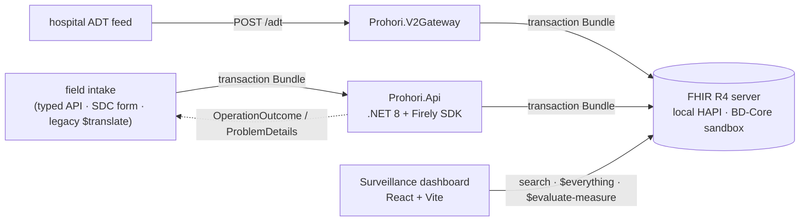

### Architecture

Four ways of getting a case into the same transaction Bundle
(`CaseBundleBuilder`), by design — each teaches a different piece of FHIR:

| Path | Endpoint | Phase |
| :--- | :--- | :--- |
| Typed API | `POST /cases` | C |
| SDC form | `POST /questionnaire-response/$extract` | J |
| Legacy ODK import | `POST /legacy-import/cases` | K |
| HL7 v2 ADT | `POST /adt` (`Prohori.V2Gateway`) | L |

### CapabilityStatement

`ProhoriCapabilityStatement` (see [Artifacts Summary](artifacts.html))
declares what `Prohori.Api` actually implements — the REST interactions per
resource type, and the custom operations this IG's other pages describe:
`$populate` / `$extract` (Questionnaire), `$evaluate-measure` (Measure). It's
checked against the running server: `GET [base]/health` reports which FHIR
server is configured, and the resource-level interactions below are the ones
`Prohori.Api`'s endpoint mappings (`Program.cs`) actually expose — nothing is
declared that the code doesn't do.

### Components

| Component | Stack | Hosting (free) |
| :--- | :--- | :--- |
| `web/` — surveillance dashboard | React 19, Vite, TanStack Query | Vercel |
| `src/Prohori.Api` — case, SDC, terminology, legacy-import and measure endpoints | .NET 8, Firely `Hl7.Fhir.R4` | Render (Docker web service; not deployed — see the repo README) |
| `src/Prohori.V2Gateway` — ADT → FHIR facade | .NET 8, NHapi, Firely `Hl7.Fhir.R4` | local / CI only |
| FHIR data store | HAPI FHIR R4 | `sandbox.fhir.dghs.gov.bd/fhir` (DGHS) for the live dashboard; local HAPI for everything else |
| This Implementation Guide | FHIR Shorthand + SUSHI + the HL7 IG Publisher | GitHub Pages |
| `deploy/` — local HAPI, local Keycloak | Docker Compose | your machine |

### Standards this build exercises

REST CRUD, `_history`, search (every parameter type, `_include`/`_revinclude`/
`_has`, chaining), transaction Bundles with `If-None-Exist`/conditional
update, `OperationOutcome`; FHIR Shorthand profiling with `required` terminology
bindings; SMART App Launch 2.0 + PKCE + OpenID Connect; SMART Backend Services
+ Bulk Data `$export`; Structured Data Capture (`$populate`/`$extract`);
terminology operations (`$expand`/`$validate-code`/`$translate`); the FHIR
Mapping Language; CQL + `Measure`/`$evaluate-measure`; and this IG itself.
